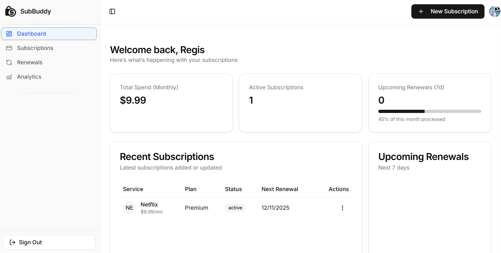

# 🎯 Subscription Sidekick

**Stop paying for subscriptions you don't use.**

A smart subscription management app that tracks renewals, sends proactive reminders, and helps you take control of your recurring expenses.


## ✨ What It Does

- **🔔 Proactive Reminders** - Get notified 7 days before renewals and trial endings
- **📊 Visual Dashboard** - See monthly/annual totals and spending breakdowns at a glance  
- **⚡ Quick Setup** - Add subscriptions in seconds with smart defaults
- **🔒 Your Data, Private** - Secure, account-based access and control

## 🚀 Quick Start

```bash
# Clone and install
git clone https://github.com/regis-mugisha/subscription-sidekick.git
cd subscription-sidekick
npm install

# Set up environment variables
cp .env.example .env.local
# Add your Clerk and Neon database credentials

# Run the development server
npm run dev
```

Open [http://localhost:3000](http://localhost:3000) to see it in action.

## 🛠️ Built With

- **Next.js 15** - React framework with App Router
- **TypeScript** - Type-safe development
- **Tailwind CSS** - Utility-first styling
- **Clerk** - Authentication & user management
- **Drizzle ORM** - Type-safe database queries
- **Neon** - Serverless PostgreSQL
- **Zustand** - Lightweight state management
- **Radix UI** - Accessible component primitives

## 📁 Project Structure

```
├── app/                    # Next.js App Router
│   ├── (protected)/       # Authenticated routes
│   │   ├── dashboard/     # Main dashboard
│   │   ├── subscriptions/ # Subscription management
│   │   ├── analytics/     # Spending analytics
│   │   └── renewals/      # Upcoming renewals
│   └── api/               # API routes
├── components/            # Reusable components
│   ├── landing/          # Landing page sections
│   ├── layout/           # App layout components
│   └── ui/               # Base UI components
├── db/                   # Database schema & migrations
└── store/                # Zustand state management
```

## 🎨 Features

### Dashboard
- Monthly/annual spending overview
- Upcoming renewals timeline
- Quick subscription management

### Subscription Management
- Add/edit/cancel subscriptions
- Filter by status, billing cycle, or search
- Track trial periods and renewal dates

### Analytics
- Visual spending breakdowns
- Usage scoring for optimization
- Historical spending trends

### Vercel Cronjob
- Update renewal dates for subscriptions that reach their expiry date.

## 🔧 Development

```bash
# Development with Turbopack
npm run dev

# Build for production
npm run build

# Start production server
npm start

# Run linting
npm run lint
```

## 📝 Environment Variables

```env
NEXT_PUBLIC_CLERK_PUBLISHABLE_KEY=your_clerk_key
CLERK_SECRET_KEY=your_clerk_secret
DATABASE_URL=your_neon_database_url
CRON_SECRET=your_random_cron_secret_here
NEXT_PUBLIC_CLERK_SIGN_IN_FALLBACK_REDIRECT_URL=/dashboard
NEXT_PUBLIC_CLERK_SIGN_UP_FALLBACK_REDIRECT_URL=/dashboard
```

## 🤝 Contributing

1. Fork the repository
2. Create a feature branch (`git checkout -b feature/amazing-feature`)
3. Commit your changes (`git commit -m 'Add amazing feature'`)
4. Push to the branch (`git push origin feature/amazing-feature`)
5. Open a Pull Request

## 📄 License

This project is licensed under the MIT License - see the [LICENSE](LICENSE) file for details.

---

**Currently in Beta** - Free to use while we gather feedback and improve the experience.